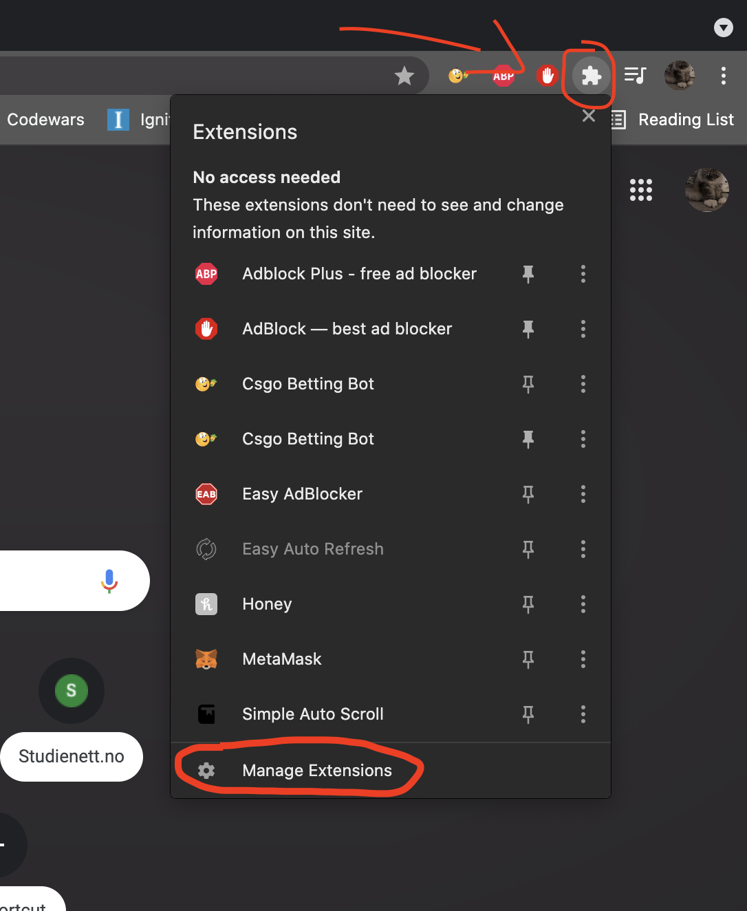
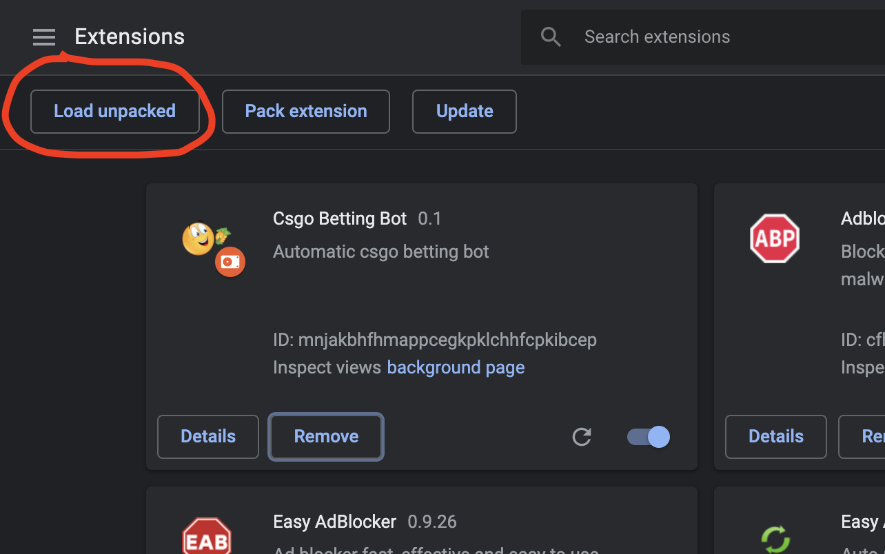
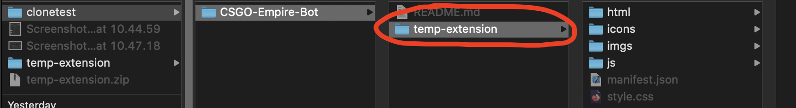

<h1>Real life money glitch</h1>

<b>Hello do you want infinite money?</b> 

Video explaining the theory: https://www.youtube.com/watch?v=zTsRGQj6VT4 

<h3>Currently waiting for Google Chrome confirmation</h3>
<b></b>It is likely that chrome won't accept this extension, but fear not! 
There is til an easy way for you to make ez money. 
<b>Just paste the content of temp-extension/js/bettingBotNew.js  
in the console of https://csgoempire.com/</b>  
<b>## Detailed Description</b> 

- A simple bot that that uses the Martingale System
- It places a set amout, and bets on CT-side every time
- If the bet is lost, it doubles the bet until it wins

<h3>How you can upload it yourself locally:</h3>
<b>Step 1:</b> Clone the project  
<b>Step 2:</b> Navigate to the extension icon in the top right corner
<b>Step 3:</b> Click "Load unpacked" in the top left corner (make sure you have developer mode on)
<b>Step 4:</b> Choose temp-extension (Important for it to work) Aaand ur done :P
