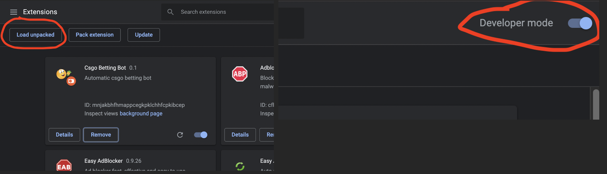

<h1>Real life money glitch</h1>

<b>Hello do you want infinite money?</b>  

Then i would suggest you to try this epicness :) 
Extension coming soon yep  
Feel free to copy the source code, but you will have to wait 
using it until I release the extension publicly
 
Video explaining the theory: https://www.youtube.com/watch?v=zTsRGQj6VT4 

<h3>Currently waiting for Google Chrome confirmation</h3>
<b></b>It is likely that chrome won't accept this extension, but fear not! 
There is til an easy way for you to make ez money. 
<b>Just paste the content of temp-extension/js/bettingBotNew.js  
in the console of https://csgoempire.com/</b>  
<b>## Detailed Description</b> 

- A simple bot that that uses the Martingale System
- It places a set amout, and bets on CT-side every time
- If the bet is lost, it doubles the bet until it wins

 <h3>How you can upload it yourself:</h3>
<b>Step1: Clone the project</b>  
<b>Step2: </b> 
<b>Step3: </b> 
<b>Step4: </b> 
